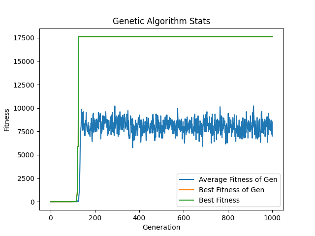

# Black-Box Optimization
This repository illustrates how genetic algorithms can be used to optimize a black-box function. The black-box function can be seen in `black_box.py`. The genetic algorithm used to solve the program can be see in `genetic.py`. The alternative brute force solution can be seen in `brute_force.py`. This example demostrates the effectiveness a genetic search algorithm has over a brute force search algorithm. 

# Results
### Genetic Algorithm:
The genetic algorithm considered `320,481` individuals and found a maximum value of `17624`.

### Brute Force
The brute force algorithm cosidered `4,000,000` individuals and found a maximum value of approximately `2.5e-13`.
