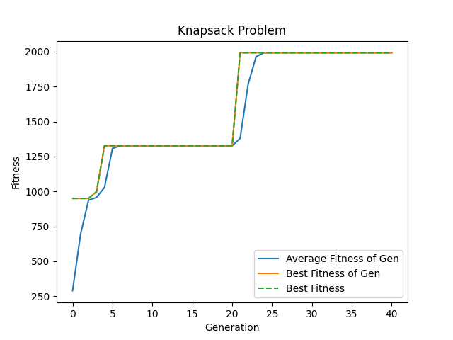
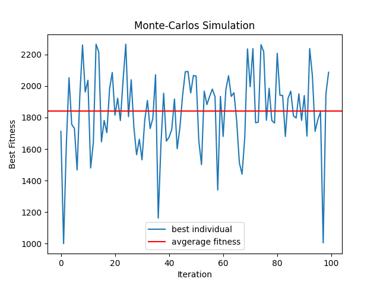

# Knapsack Problem
Solves the classic knapsack problem using a genetic algorithm. The problem can be solved by running `genetic.py`. The Monte-Carlo simulation can be run by running `montecarlo.py`.

## Problem Statement:
Choose which items to pack into a knapsack to maximize the value of the knapsacks contents without exceeding the specified weight limit.

**Weight Limit:** 10 kg

**Item Set:**

| Name | Weight (kg) | Value ($) |
:---: | :---: | :---: |
|laptop| 3| 300|
|book| 2| 15|
|radio| 1| 30|
|tv| 6| 230|
|potato| 5| 7|
|brick| 3| 1|
|bottle| 1| 2|
|camera| 0.5| 280|
|smartphone| 0.1| 50
|picture| 1| 170|
|flower| 2| 5|
|chair| 3| 4|
|watch| 0.05| 500|
|boots| 1.5| 30|
|radiator| 5| 25|
|tablet| 0.5| 450|
|printer| 4.5| 170|

# Results

**Items Packed:** book, radio, camera, smartphone, picture, watch, printer

**Total Value:** $1992

**Total Weight:** 9.15 kg

**Number of Individuals:** 998

The algorithm considers less than 1000 individuals which is a fraction of the total possible item combinations.

## Exploration Plot:

**Note:** that results are specific to our random seed.

# Monte-Carlo Simulation

**Note:** Not run using a random seed.
